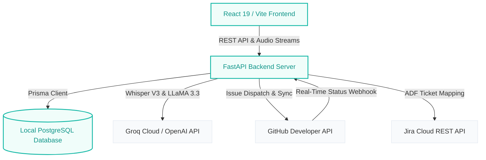

# 🎙️ Verbex: Meeting Intelligence Reimagined

> Transform raw, unstructured conversations into structured, actionable engineering realities.

---

<p align="center">
  
</p>

<p align="center">
  <strong>FastAPI</strong> &bull; <strong>React 19</strong> &bull; <strong>TypeScript</strong> &bull; <strong>Prisma ORM</strong> &bull; <strong>PostgreSQL</strong> &bull; <strong>Groq LLaMA 3.3</strong>
</p>

---

## 💡 The Core Concept

Verbex sits at the intersection of team collaboration and issue tracking. By leveraging high-performance large language models and whisper-fast transcription, it listens to your sync meetings, analyzes conversations, extracts tasks and decisions, and maps them directly to your team members' engineering backlogs on **GitHub** and **Jira**.

## 🛠️ Tech Stack

- 🖥️ **Frontend**: React 19, TypeScript, Vite 6, Tailwind CSS v4, Lucide React
- ⚙️ **Backend**: FastAPI, Python 3.12, Uvicorn, Prisma Client Python
- 🗄️ **Database**: PostgreSQL (Local relational database managed via Prisma ORM)
- 🤖 **AI Models**: Groq Whisper Large V3-Turbo (Audio Transcription), Groq LLaMA 3.3 (Summary & Action Items Extraction)

---

## 🏗️ Architecture



---

## 🚀 Key Ingestion & Intelligence Engines

### 🎙️ 1. Hybrid Transcription Engine
*   **Dual-Stream Audio Mixing**: Integrates the browser's **Web Audio API** to mix microphone capture and system display audio (like Google Meet/Zoom presentation feeds) into a single high-quality stream.
*   **Fail-Safe Ingestion Fallback**: Uses browser-level **Web Speech API** for real-time transcript preview, serving as a backup transcription buffer if network connections to backend Whisper endpoints drop.
*   **High-Speed Whisper Parsing**: Powered by **Groq Whisper Large V3-Turbo** for near-instant post-meeting transcription.

### 🧠 2. AI Intelligence & Feature Gate
*   **LLaMA 3.3 Entity Extraction**: Parses transcripts using customized, structured extraction prompts, identifying owners, priority levels, and extracting exact transcript source quotes.
*   **Confidence Gate Kanban**: Categorizes extracted tasks into a 3-column Kanban board based on AI extraction confidence score thresholds: Auto-Pushed ($\ge 0.75$), Needs Review ($0.50$ - $0.74$), and Discarded ($< 0.50$).

### 🔄 3. Bidirectional Project Status Sync
*   **GitHub webhook Integration**: Automatically listens to issue closure/reopening webhook events, updating local task cards and recalculating the associated meeting's **Health Score**.
*   **Jira ADF Translation**: Translates meeting notes and descriptions dynamically into Atlassian Document Format (ADF) JSON payloads.

---

## 🚦 Getting Started

### 📋 Prerequisites
Make sure you have the following installed locally:
*   [Node.js](https://nodejs.org/) (v18+)
*   [Python](https://www.python.org/) (3.10+)
*   [PostgreSQL](https://www.postgresql.org/) (Local running instance)
*   [Groq API Key](https://console.groq.com/)

---

### 🔧 Local Setup & Run

#### 1. Configure the Environment
Create a `.env` file inside the `backend/` directory (see [Environment Variables](#-environment-variables) below).

#### 2. Spin Up the Backend (FastAPI)
```bash
# Navigate to backend
cd backend

# Initialize and activate Python virtual environment
python -m venv venv
# On Windows:
venv\Scripts\activate
# On macOS/Linux:
source venv/bin/activate

# Install requirements
pip install -r requirements.txt

# Sync PostgreSQL schema & compile Prisma Client
prisma db push

# Seed initial employee directory list
python seed_db.py

# Launch development server
uvicorn main:app --reload
```

#### 3. Spin Up the Frontend (Vite)
```bash
# Navigate to frontend
cd frontend

# Install Node dependencies
npm install

# Start Vite dev server
npm run dev
```

---

## 🔐 Environment Variables

Create a `backend/.env` file with the following variables:

| Key | Description |
|:---|:---|
| `DATABASE_URL` | PostgreSQL connection string |
| `GROQ_API_KEY` | Your Groq Cloud API credentials |
| `GITHUB_TOKEN` | Global GitHub personal access token |
| `GITHUB_REPO_OWNER`| Target repository owner |
| `GITHUB_REPO_NAME` | Target repository name |
| `JIRA_EMAIL` | Global Jira account email |
| `JIRA_API_TOKEN` | Global Jira developer API token |
| `JIRA_DOMAIN` | Target Jira workspace subdomain |
| `JIRA_PROJECT_KEY` | Jira project key prefix |

---

## 🔧 Database Utilities

From the `backend/` directory, you can run the following helper scripts:
*   **Seed Employees**: `python seed_db.py`  
    *Populates the database with default engineers and managers ready to receive task assignments.*
*   **Purge Database & Storage**: `python clear_data.py`  
    *Truncates all data tables (cascade deleting tasks/meetings) and purges cached local recordings from `storage/audio/`.*

---

## 📖 Platform Tour

*   **Manager View**: High-level strategic overview of your team's meeting metrics, confidence scores, and workload load chart.
*   **All Meetings**: Explore the meeting catalog, inspect transcripts, and edit tasks/decisions.
*   **Task Board**: Kanban view tracking tasks categorized by AI confidence gates.
*   **Decision Log**: A permanent timeline ledger of resolved agreements from meeting syncs.
*   **Speaker Map**: Algorithmic voice tracking and speaker ownership mapping.
*   **Stale Tasks**: Alerts listing delayed tasks older than 7 days that require management action.

